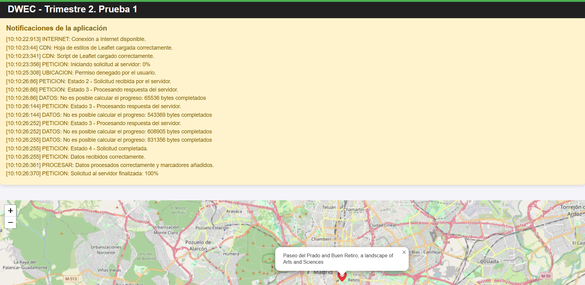

# Formatos notificaciones
Según el tipo de mensaje que se deba mostrar en el panel de notificaciones se facilitan por un lado el código del momento en el que ocurre (clase Date)
```javascript
const now = new Date();
li.textContent = `[${now.getHours()}:${now.getMinutes()}:${now.getSeconds()}:${now.getMilliseconds()}] ${mensaje}`;
```
En cuanto a las notificaciones:
- Si es un error ya sea de carga, internet o cualquier situación inesperada: ***`ERROR: ...`***
- Si se están procesando los datos de la petición, calculando el total cargado, etc (todo lo que tenga que ver con procesamiento de datos): ***`PROCESAR: `***
- Si en la petición se cambia de estado: ***`PETICION: Estado X - .....`***. Tambien se debe usar este formato para mostrar la carga inicial (0%) y la carga final  (100%) de datos (sin mostrar ***`Estado X`*** al no ser un cambio de estado sino información de la petición).
- Si la petición lanza un código (200, 404, 500, etc): ***`CODIGO XXX: ...`***
- Si la información es de la ubicación del usuario: ***`UBICACION: ...`***

# Enlaces proporcionados 

## Datos
Se proporcionan los enlaces de 3 posibles opciones de recepción de datos de ubicaciones, es decir, 3 posibles opciones de llamadas AJAX de las que hay que seleccionar una.

###  Wikidata API: 
```javascript
const URL = "https://query.wikidata.org/sparql?query=" +
    encodeURIComponent(`
        SELECT ?item ?itemLabel ?coord WHERE {
          ?item wdt:P1435 wd:Q9259.
          ?item wdt:P625 ?coord.
          SERVICE wikibase:label { bd:serviceParam wikibase:language "[AUTO_LANGUAGE],en". }
        } 
    `) + "&format=json";
```
### Overpass API (turismo en Madrid): 
```javascript
const URL = "https://overpass-api.de/api/interpreter?data=[out:json];area[name=\"Madrid\"];node[\"tourism\"=\"attraction\"](area);out;";

```

### Overpass API (monumentos cerca de Madrid):
```javascript
const URL = "https://overpass-api.de/api/interpreter?data=[out:json];node[\"historic\"=\"monument\"](around:5000,40.416775,-3.703790);out;";
```

---

## Iconos
Se proporcionan los códigos de los iconos que deben utilizarse.
### Geolocalización
`https://cdn-icons-png.flaticon.com/512/69/69524.png`
### Resto ubicaciones
`https://cdn-icons-png.flaticon.com/512/252/252025.png`

---

## Carga ficheros
Código para la carga de ficheros con el DOM.
```javascript
 // Crear e insertar la hoja de estilos
        const link = document.createElement("link");
        link.rel = "stylesheet";
        link.href = "https://unpkg.com/leaflet@1.9.4/dist/leaflet.css";
        link.integrity = "sha256-p4NxAoJBhIIN+hmNHrzRCf9tD/miZyoHS5obTRR9BMY=";
        link.onload = () => {}
        link.onerror = () => {}
        document.head.appendChild(link);

        // Crear e insertar el script de Leaflet
        const script = document.createElement("script");
        script.src = "https://unpkg.com/leaflet@1.9.4/dist/leaflet.js";
        script.integrity = "sha256-20nQCchB9co0qIjJZRGuk2/Z9VM+kNiyxNV1lvTlZBo=";
        script.onload = () => { }
        script.onerror = () => { }
        document.head.appendChild(script);
```
---

## Otras ayudas de código.

### Transformación de formato.
Para aquellos estudiantes que elijan ***`Wikidata API:`*** se facilita una línea de código que transforma en un array las coordenadas. Tambien puede ser utilizado para las otras dos API pero de forma diferente.

```javascript
const coords = lugar.coord.value.replace("Point(", "").replace(")", "").split(" ");
```

## Ejemplo de panel de notificaciones


## IMPORTANTE

- Todo código con errores en consola tendrá como nota máxima un 4,5. Todo ello teniendo en cuenta que está todo lo pedido.
- Se calificará el funcionamiento de cada parte. El procedimiento no será importante. Debemos acostumbrarnos a realizar las cosas bien y con detalle.
- En la corrección se realizarán pruebas, entre otras, de conexión a internet y ubicación desactivada. No se permite un error en consola en ninguno de estos casos.
- La entrega se realiza por el Aula virtual en la tarea habilitada para ello. Formato ***apellido_nombre.zip***
- El vídeo se entrega ***el enlace*** por mail.
- No se corrigen ejercicios sin vídeo.
- No se permite el uso de ninguna documentación que no sea la del GitHub de clase o consultas en internet (***SIEMPRE FACILITANDO LA FUENTE EN EL CÓDIGO O EN EL README.MD***). Se penalizará con, al menos 1 punto, por cada código extraido de internet sin colocar la fuente.
- No se permite el uso de ninguna inteligencia atificial o extensión que realice código. La penalización será un 0 en el examen.